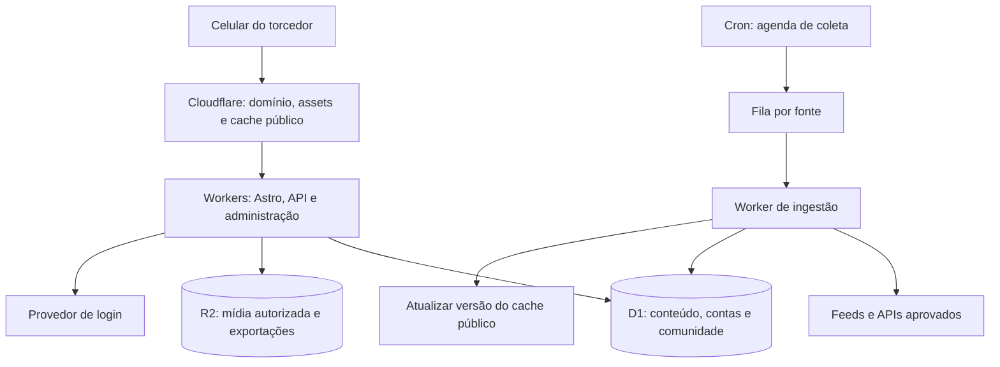

# ADR-001 — Portal serverless com conteúdo agregado

**Status:** Proposto. **Data:** 05/09/2026. **Responsável pela decisão final:** fundador.

## Contexto

Portal móvel com muita leitura pública, agregação automatizada e picos de comentários em partidas. A prioridade é reduzir operação e custo ocioso. Anúncios podem sustentar crescimento, mas receita e demanda ainda não foram medidas.

## Decisão proposta

Um monólito modular em TypeScript, com **Astro + componentes React interativos**, hospedado em **Cloudflare Workers**, banco **D1** e mídia **R2**. Agregação usa **Cron Triggers + Queues**, com um consumidor do mesmo repositório. Estilos por tokens e CSS; biblioteca de componentes só quando trouxer ganho concreto.

Astro serve páginas orientadas a conteúdo e permite reservar interatividade para comentários, conta e fórum. Validar SSR, integração React, autenticação e bindings no runtime real antes de consolidar dependências. A Cloudflare documenta a implantação de Astro em Workers: [guia oficial](https://developers.cloudflare.com/workers/framework-guides/web-apps/astro/).

Uma aplicação e uma base de código, com módulos separados para conteúdo, partidas, comunidade, identidade, moderação e ingestão. API no mesmo domínio, sem microsserviços iniciais. Não escolher versões de bibliotecas neste planejamento; fixar versões compatíveis após a prova técnica.

O diagrama é uma proposta, não infraestrutura existente. Configurar fila com novas tentativas limitadas e destino para falhas definitivas; verificar condições e preços desses serviços antes do provisionamento.

## Alternativas consideradas

| Opção                   | Benefício                                                 | Custo de adoção / limitação                                                        | Quando escolher                                              |
| ----------------------- | --------------------------------------------------------- | ---------------------------------------------------------------------------------- | ------------------------------------------------------------ |
| Astro + Workers + D1    | Poucos serviços, páginas leves e cobrança orientada a uso | SQL com semântica SQLite, limites por banco e dependência de bindings              | Recomendação para a primeira versão                          |
| Next.js + Workers + D1  | Ecossistema React e aplicação integrada                   | Adiciona adaptação OpenNext e sua matriz de compatibilidade                        | Se a equipe dominar Next.js e validar as funções necessárias |
| Workers + Neon Postgres | PostgreSQL e possibilidade de suspender compute ocioso    | Outro fornecedor, latência de retomada e jobs recorrentes podem impedir ociosidade | Quando extensões, consultas ou portabilidade justificarem    |
| Next.js + Vercel        | Caminho direto para uma equipe especializada em Next.js   | Planejar plano adequado à exploração comercial                                     | Se velocidade de entrega compensar o custo contratado        |

Next.js em Workers tem [guia oficial](https://developers.cloudflare.com/workers/framework-guides/web-apps/nextjs/). Neon descreve [suspensão do compute ocioso](https://neon.com/docs/introduction/scale-to-zero). Vercel Hobby é restrito a uso pessoal não comercial, portanto não é a base orçamentária de um portal com anúncios: [condições do plano](https://vercel.com/docs/plans/hobby).

## O que significa scale to zero aqui

Workers executa sob demanda; não há VM da aplicação mantida continuamente. D1 não cobra horas de compute: mede consultas e armazenamento. Isso não significa conta sempre zero: planos, armazenamento, requisições, filas, coletas agendadas e serviços externos podem gerar custo mesmo sem visitantes. [Cobrança D1](https://developers.cloudflare.com/d1/platform/pricing/).

## Modelo de dados inicial

| Entidade                    | Campos / restrições principais                                                                                          |
| --------------------------- | ----------------------------------------------------------------------------------------------------------------------- |
| users, identities, sessions | Apelido, estado, papel; identidade única por provedor e identificador; sessão com expiração                             |
| sources                     | URL aprovada, campos permitidos, condições de uso registradas, frequência, enabled, última coleta, ETag                 |
| ingestion_runs              | Fonte, início/fim, resultado, contagens e erro sanitizado                                                               |
| news_items                  | Tipo agregado/próprio, fonte, external_id, canonical_url, título, descrição permitida, estado, published_at, fetched_at |
| articles, article_revisions | Corpo próprio, autor, rascunho/publicado e histórico de correções                                                       |
| matches                     | Identidade externa opcional, adversário, competição, kickoff UTC, estado, resultado, fonte, updated_at                  |
| threads                     | Tipo notícia/jogo/geral, vínculo exclusivo com notícia ou partida, título e estado                                      |
| comments                    | Thread, autor, parent_id opcional, texto, estado, created_at; chave de idempotência por autor                           |
| reactions                   | Usuário, alvo e tipo; unicidade por usuário/alvo                                                                        |
| reports, moderation_actions | Alvo, motivo, estado da revisão, responsável e decisão                                                                  |
| media                       | Chave do objeto, dimensões, crédito, origem e condições de uso                                                          |

Usar IDs estáveis, índices para estado/data e thread/data/id, paginação por cursor e parâmetros SQL. Não executar contagens completas em cada visita. Unicidade de source/external_id e canonical_url normalizada evita duplicatas; normalização preserva parâmetros que identifiquem conteúdo.

Uma thread por notícia ou jogo permite compartilhar a infraestrutura do fórum sem duplicar conversas. Uma exclusão visível pode preservar marcador na conversa; retenção administrativa e expurgo precisam de política definida antes do lançamento.

## Ingestão automatizada

1. Scheduler enfileira fontes habilitadas e vencidas, respeitando orçamento de coleta.
2. Consumidor busca feed/API com timeout, tamanho máximo, backoff e cabeçalhos condicionais quando disponíveis.
3. URL de origem vem de allowlist administrativa. Validar também redirects e bloquear destinos internos; usuários não podem instruir o servidor a buscar URLs arbitrárias.
4. Normalizar datas, URLs e texto. HTML externo é não confiável: sanitizar ou reduzir a texto. Sem execução de scripts ou uso de conteúdo como instrução para IA.
5. Fazer upsert idempotente. Campos fora do contrato, item incompleto e erro de parsing vão para revisão. Link suspeito não é publicado automaticamente.
6. Atualizar versão do feed/cache após publicação bem-sucedida. Guardar última coleta bem-sucedida e alertar se ultrapassar duas janelas previstas.
7. Fonte indisponível mantém o último conteúdo válido, com data. Não reexecutar infinitamente nem bloquear toda a home.

Evitar scraping com navegador no MVP: encarece e fragiliza a operação. A descoberta das fontes e a confirmação de suas integrações são entregas anteriores à implementação do importador.

## Leitura, escrita e picos de jogo

Páginas editoriais retornam HTML renderizado no servidor com cache público. Assets estáticos recebem cache longo e versões no nome. Separar dados pessoais, cookies de sessão e respostas de escrita do cache público: `private/no-store`. Publicação e retirada de conteúdo invalidam as chaves correspondentes; validar a retirada em todos os caminhos de cache.

Parâmetros iniciais de projeto: feed com TTL de 60–120 s; informações manuais de jogo com TTL de 60 s e data visível; comentários carregados sob demanda. Na discussão aberta, consultar novas mensagens a cada 30–60 s apenas com aba visível, usando jitter, backoff e botão para inseri-las. Não buscar toda a thread novamente.

Exemplo de capacidade, não previsão: 2.000 leitores consultando a cada 30 s geram aproximadamente 67 requisições/s e 480 mil em duas horas. Com média hipotética de 5 linhas retornadas por consulta, são 2,4 milhões de linhas retornadas; linhas realmente lidas podem ser mais altas e precisam ser medidas. Cache pode reduzir consultas ao banco, mas não se deve presumir que elimine cobrança por requisições Workers.

D1 tem limites por banco e capacidade finita; serverless não elimina gargalo de escrita. Fazer teste com consultas reais e medir p95, erros e linhas lidas. [Limites oficiais](https://developers.cloudflare.com/d1/platform/limits/). Se houver saturação persistente após índices/cache, avaliar PostgreSQL ou divisão justificada dos dados. WebSockets/Durable Objects só entram se polling se tornar insuficiente e o benefício for demonstrado.

## Segurança, qualidade e operação

Autenticação por biblioteca mantida, sessão segura HttpOnly/Secure e proteção CSRF/origin nas escritas; autorização por papel no servidor. Rate limit por conta/IP com estado apropriado ao ambiente distribuído, sem confiar em memória de um único Worker. Proteção antibot nos fluxos de abuso; verificar a ferramenta e o plano na implementação.

Separar desenvolvimento, preview e produção, incluindo bancos, mídia e segredos. Preview sem indexação; não usar dados pessoais reais. CI executa tipos, validações e testes de integração para duplicatas, permissões, suspensão, publicação e ingestão com falhas. Fluxos críticos de leitura/login/comentário passam por teste de navegador.

Metas de experiência para validar em campo: LCP até 2,5 s, INP até 200 ms e CLS até 0,1 no percentil 75. São metas propostas. Reservar espaço dos anúncios; medir também em celular intermediário e conexão móvel. Não considerar teste local equivalente a tráfego real.

Observar taxa de erros, latência, freshness das fontes, filas, linhas lidas/escritas, cache, custo e denúncias pendentes. Logs não incluem tokens, e-mails nem corpo completo de comentários. Exportação periódica do banco e inventário de mídia, cópia separada e ensaio de restauração antes do piloto. Definir retenção e frequência conforme volume; objetivo inicial proposto: recuperar em 4 horas com perda de até 24 horas, ainda não validado.

## Orçamento e publicidade

Preços consultados em 05/09/2026; confirmar novamente antes de contratar. Valores em USD, sem conversão, impostos, domínio, trabalho editorial ou serviços de terceiros.

- Workers Paid: mínimo de US$ 5/mês, com 10 milhões de requisições e 30 milhões de ms de CPU incluídos; excedentes de US$ 0,30/milhão de requisições e US$ 0,02/milhão de ms de CPU. [Tabela oficial](https://developers.cloudflare.com/workers/platform/pricing/).
- D1 Paid: inclui 25 bilhões de linhas lidas/mês, 50 milhões escritas/mês e 5 GB. Índices e consultas afetam o consumo. Plano gratuito tem limites diários que podem interromper consultas. [Tabela oficial](https://developers.cloudflare.com/d1/platform/pricing/).
- R2 Standard: franquia de 10 GB-mês e franquias de operações; excedente de armazenamento de US$ 0,015/GB-mês; egress sem cobrança. Operações também têm preço. [Tabela oficial](https://developers.cloudflare.com/r2/pricing/).

**Simulação estreita:** 1 milhão de execuções de Worker/mês a 10 ms médios de CPU = 10 milhões de ms. Nesse cenário, Workers fica no mínimo de US$ 5; D1/R2 só permanecem sem excedente se seus próprios limites forem respeitados. Isso não estima o custo total do portal. Filas, build, mídia processada, APIs esportivas, autenticação contratada e observabilidade devem entrar na planilha real. IA tem orçamento separado se adotada.

Não converter pageviews diretamente em requisições: cada página pode gerar várias consultas e atualizações. Contabilizar jobs agendados, bots e leitores sem anúncios.

Modelo para decisão comercial: `receita mensal = pageviews / 1.000 × RPM de página líquido observado`. Se houver 100 mil pageviews, RPM hipotético de R$ 2, R$ 5 ou R$ 10 produz R$ 200, R$ 500 ou R$ 1.000. Esses números são cenários aritméticos, não estimativas de mercado nem promessa de receita. Usar RPM de página, não RPM de impressão de anúncio.

`margem operacional = receita líquida − infraestrutura − dados/licenças − ferramentas − operação editorial/moderação`. Ponto de equilíbrio simplificado: `1.000 × custo mensal / RPM líquido`, apenas para um custo assumido fixo; recalcular custos variáveis a cada faixa de tráfego. Subtrair impostos/taxas caso não estejam no valor líquido usado.

Condições para escalar: medir receita real, custo por mil pageviews e custo por participante; reter usuários sem piorar desempenho; configurar alertas em 50/80/100% do orçamento escolhido. Alertas não são teto de cobrança. Ter chave para reduzir polling, coletas e funcionalidades não essenciais durante excesso de consumo.

## Consequências e validações pendentes

Ganha-se operação pequena e baixo custo inicial. Assume-se dependência da Cloudflare e trabalho próprio de administração/comunidade. Exportações e separação dos módulos ajudam uma futura migração, mas não tornam a troca de banco automática.

Antes de aceitar esta ADR: validar três fontes utilizáveis, ingestão idempotente, biblioteca de login no runtime, escrita concorrente da comunidade, tratamento de cache e uma simulação de custos incluindo filas. Sem esses resultados, a stack continua proposta.
